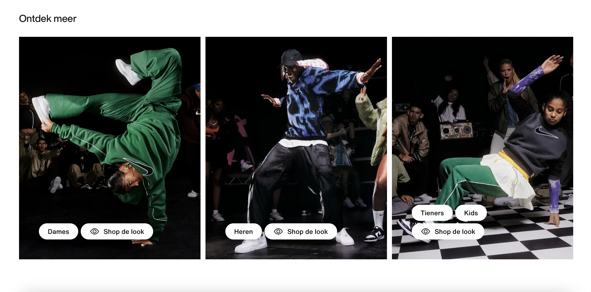
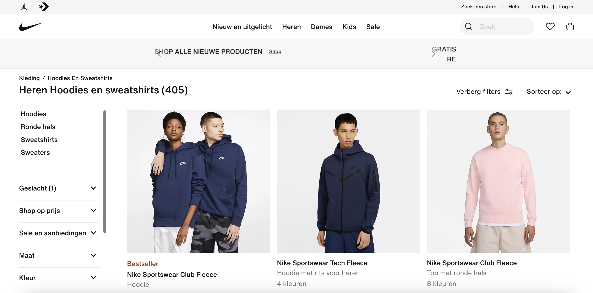
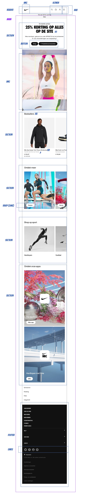
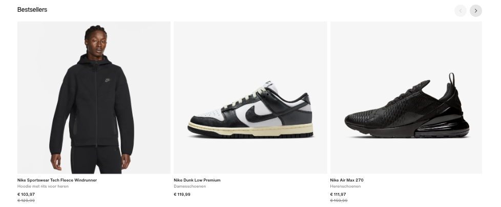
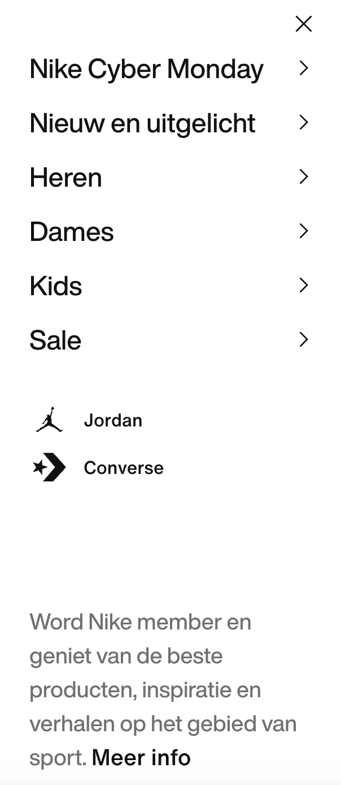
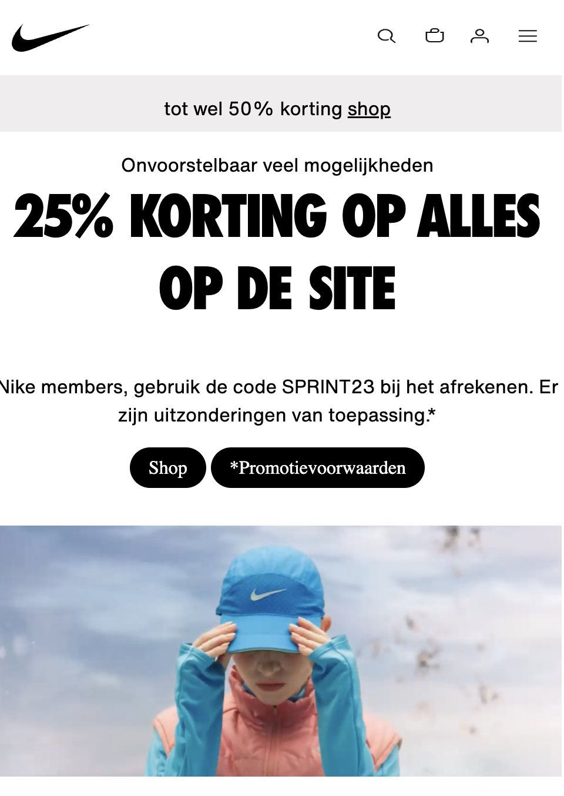
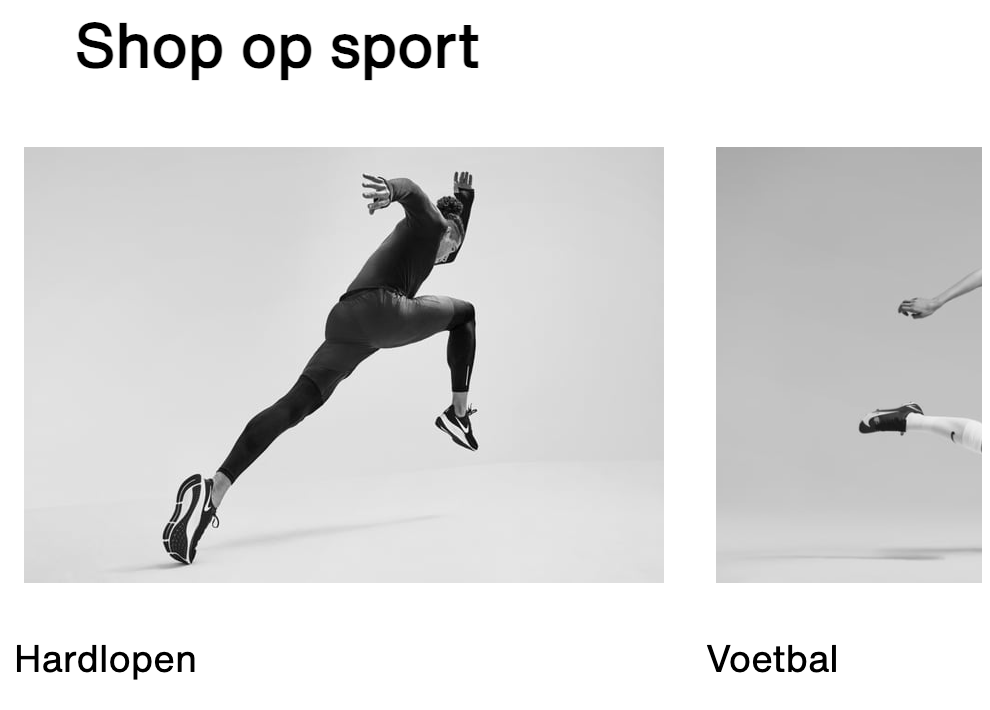
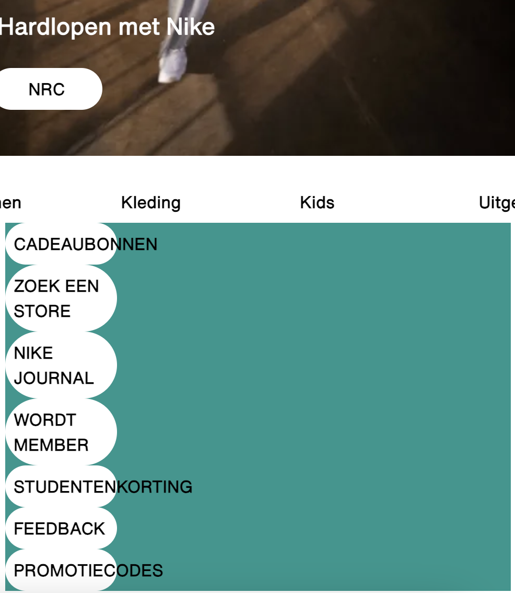

# Procesverslag
Markdown is een simpele manier om HTML te schrijven.  
Markdown cheat cheet: [Hulp bij het schrijven van Markdown](https://github.com/adam-p/markdown-here/wiki/Markdown-Cheatsheet).

Nb. De standaardstructuur en de spartaanse opmaak van de README.md zijn helemaal prima. Het gaat om de inhoud van je procesverslag. Besteedt de tijd voor pracht en praal aan je website.

Nb. Door *open* toe te voegen aan een *details* element kun je deze standaard open zetten. Fijn om dat steeds voor de relevante stuk(ken) te doen.

## Jij

  
uitwerken voor kick-off werkgroep

  ### Auteur:
  Niels Lehman

  #### Je startniveau:
  Blauwe piste

  #### Je focus:
  surface 

## Je website

  
uitwerken voor kick-off werkgroep

  ### Je opdracht:
Nike website > https://www.nike.com/nl/  
  #### Screenshot(s) van de eerste pagina (small screen): 
  homepagina
  

  #### Screenshot(s) van de tweede pagina (small screen):
  hoodies en truien 
  
 

## Toegankelijkheidstest 1/2 (week 1)

  
uitwerken na test in 2e werkgroep

  ### Bevindingen
  Lijst met je bevindingen die in de test naar voren kwamen:
- De code bevat veel errors.
- Op de homepagina is het niet helemaal duidelijk hoe je een artikel of product selecteerd.
- Filmpjes kunnen niet gepauzeerd worden.
- De controls zijn niet altijd even duidelijk.
- De website bevat niet veel animaties.
- Dark en lightmode worden niet ondersteund.
- Tekstvergroten is ook niet mogelijk.

## Breakdownschets (week 1)

  
uitwerken na afloop 3e werkgroep

  ### de hele pagina: 
  

  ### dynamisch deel (bijv menu): 
  

  ### wellicht nog een dynamisch deel (bijv filter): 
  

## Voortgang 1 (week 2)

  
uitwerken voor 1e voortgang

  ### Stand van zaken
Bezig geweest met de bovenkant van de website en de eerste knoppen.

  ### Agenda voor meeting
  samen met je groepje opstellen

samen met je groepje opstellen

Quinten:
- Moet een form om mee te zoeken in de header of er buiten?
- Hoe maak ik dingen klikbaar zonder meer dan 1 html pagina?
- Hoe spreek ik mijn gewenste images aan? Ze zitten allemaal boven een h3 dus mis kan ik daar wat mee.
- Marquee, hoe werkt het met screenreader en hoe maak ik drie verschillende berichtjes?

Ahmadriza:
- Ik wil weten hoe je een video/annimatie van de inspector kunt halen. Bij mijn site is dat nog ingewikkeld.
- Hoe de li in de nav zo tonen dat op mobiel formaat het verdwijnt in de dropdown menu en bij desktop wel zichrbaar is

Niels:
- Ik wil weten hoe ik de knoppen beter kan centreren en de specifieke vormgeving aan kan passen
- Weten hoe ik de verschillende afbeeldingen een eigen stijl kan geven op een makkelijke manier
- Hoe kan ik de screenreader goed maken

Merle:
- Hoe kan ik ervoor zorgen dat de carousel iedere keer 1 foto opschuift?
- Hoe kan ik op een nette manier fontface gebruiken om nieuwe fonts en font weights toe te voegen?

  ### Verslag van meeting
  hier na afloop snel de uitkomsten van de meeting vastleggen

- Iconen op de juiste plaats dmv grid.
- De bewegende slider > code van Merle.

## Voortgang 2 (week 3)

  
uitwerken voor 2e voortgang

  ### Stand van zaken
  Ik ben ver gekomen met de homepagina van mijn website, het belangrijkste is nog om de footer toe te voegen, en de iconen in mijn navbar te verbeteren.

  

  

  

  ### Agenda voor meeting
  samen met je groepje opstellen

Quinten:
- Meer duidelijkheid over het inzetten van flexbox op bepaalde elemente
- De fonts van sanrio er in krijgen, zijn moeilijk te vinden
- De form over de hele breedte te laten spannen

Ahmadriza:
- in m’n 3e section beter grid of flex gebruiken (responsieve)
- ik wil m’n video automatisch laten afspelen
- Mijn nav ook zichtbaar houden tijdens scrollen hiervoor position fixed/absolute?

Niels:
- Hoe ik de horizontale box met text die automatisch beweegt maak
- Hoe ik de footer apart aanspreek zonder de code al te veel aan te passen.
- Wanneer nou button en wanneer een link (precieze verschil)
- nth of type mag dat steeds?

Merle:
- Ik krijg met flexbox en grid mijn ‘li’ niet gecentreerd en op de plek waar ik hem wil, hoe kan ik dit oplossen?
- Wat is een mooie volgorde om mijn css in te schrijven? Sanne liet zien welke volgorde hij gebruikte, en hoe weet ik precies wat er onder welke categorie valt?

  ### Verslag van meeting
  hier na afloop snel de uitkomsten van de meeting vastleggen

  - punt 1
  - punt 2
  - nog een punt
- ...

## Toegankelijkheidstest 2/2 (week 4)

  
uitwerken na test in 9e werkgroep

  ### Bevindingen
  Lijst met je bevindingen die in de test naar voren kwamen (geef ook aan wat er verbeterd is):

## Voortgang 3 (week 4)

  
uitwerken voor 3e voortgang

  ### Stand van zaken
Veel geoefend met de header en footer, de footer is nog even lastig. Ergens een fout gemaakt dus deze opnieuw maken.

  ### Agenda voor meeting
  samen met je groepje opstellen

Niels:
  - Mijn svg iconen vervormen steeds, hoe kan ik het formaat aanpassen want ze zijn beveiligd op de originele website?
  - Hoe link je precies het lettertype in de juiste map, wel gedownload op laptop maar niet in juiste map.
  - Hoe zit het met H2 en H3, de belangrijkste tekst is een hogere h, ook al komt deze later op de website pas?

Quinten:
- Hoe zit het met een kleiner kopje boven een belangrijker kopje, is dit bv een h2 of h3 en welke moet eerst komen (css, html)
- ⁠Hamburger menu, hoe verander ik het icoon
- ⁠Moeten de dropdowns in het hamburgermenu werken?
- ⁠Is het oke om layouts van lijstjes veel te veranderen voor bruikbaarhuid?

Merle:
- Hoe kan ik mijn navigatie laten werken?
- ⁠Wat is de beste manier om het responsief te maken?
- ⁠Hoeveel moet je maken met JavaScript? Als je weinig hebt, wordt dat dan meegerekend in het eindcijfer?

Ahmadriza:
• Hoe mijn video pauzeren (voor toegankelijkheid)
• de state visited link uitleggen 
• De footer responsieve maken

  ### Verslag van meeting
  hier na afloop snel de uitkomsten van de meeting vastleggen

  - punt 1
  - punt 2
  - nog een punt
  - ...

## Eindgesprek (week 5)

  
uitwerken voor eindgesprek

  ### Je uitkomst - karakteristiek screenshots:
  

  ### Dit ging goed/Heb ik geleerd: 
  Korte omschrijving met plaatjes

  

  ### Dit was lastig/Is niet gelukt:
  Korte omschrijving met plaatjes

  

## Bronnenlijst

  
continu bijhouden terwijl je werkt

  Nb. Wees specifiek ('css-tricks' als bron is bijv. niet specifiek genoeg). 
  Nb. ChatGpT en andere AI horen er ook bij.
  Nb. Vermeld de bronnen ook in je code.

  1. bron 1
  2. bron 2
  3. ...

